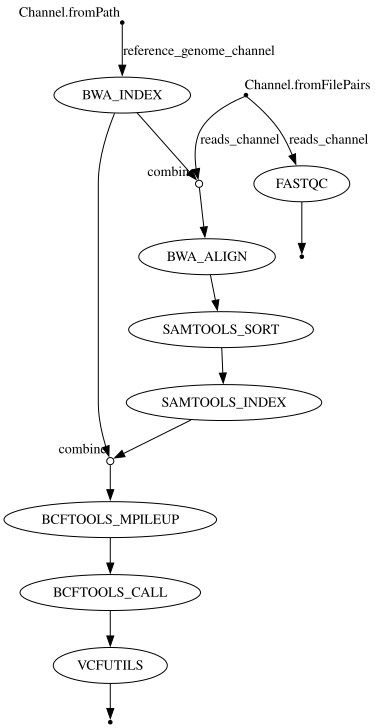

# **🧬 Variant Calling Nextflow Pipeline**

[](https://www.nextflow.io/)

[](https://hub.docker.com/r/milesbailey121/variant-calling)

[](https://aws.amazon.com/batch/)

[](https://docs.conda.io/)

  

**A  scalable,  reproducible variant calling pipeline using BWA and SAMtools/BCFtools for genomic data.**

  

This Nextflow pipeline aligns paired-end reads to a reference genome using **BWA-MEM**, processes the alignments with **SAMtools**, and calls variants using **BCFtools**. It's designed for ease of use across local Conda environments, Docker containers, and AWS.

  

## Features

  

-  **Modular** and easily extendable Nextflow workflow

-  **Multi-platform** execution support (Conda, Docker, AWS Batch)

-  **Reproducible** environments with Docker and Conda

-  **Parallelized** execution for performance

-  **Scalable** cloud-ready design with AWS Batch integration

-  **Automated quality control**, alignment, sorting, and variant calling

  
  
  

## Project Structure

  

```

variant-calling-workflow/

├── data/ # Input data (user-provided)

├── variant-calling.nf # Main Nextflow pipeline

├── nextflow.config # Global configuration and profiles

├── environment.yml # Conda environment file

└── Dockerfile # Docker container definition

```

  
  
  

## Pipeline Overview



  

The pipeline performs the following steps:

  

1.  **FASTQC**: Quality control of input FASTQ files

2.  **BWA index**: Indexing the reference genome

3.  **BWA-MEM**: Aligning reads to the reference genome

4.  **SAMtools sort**: Sorting and indexing BAM files

5.  **BCFtools**: Calling variants to produce a final VCF file

  
  
  

## Installation & Setup

  

### Clone Repository

  

```bash

git  clone  https://github.com/<your-username>/variant-calling.git

cd  variant-calling

  

```

  
  

## Environment Setup Options

  

### Option 1: Conda (Local)

  

#### Set Up

  

```bash

conda  env  create  -f  environment.yml

conda  activate  variant-calling

  

```

  

#### Run

  

```bash

nextflow  run  variant-calling.nf  -profile  conda  \

--genome "data/genome/your_genome.fasta" \

--reads  "data/reads/*_{1,2}.fastq.gz"  \

--outdir "results/"

  

```

or update nextflow.config with paths

```bash

nextflow  run  variant-calling.nf  -profile  conda

```

----------

  

### Option 2: Docker

  

#### Pull Image

  

```bash

docker  pull  milesbailey121/variant-calling:latest

  

```

  

Or build it:

  

```bash

docker  build  -t  variant-calling  .

  

```

  

#### Run

  

```bash

nextflow  run  variant-calling.nf  -profile  docker  \

--genome "data/genome/your_genome.fasta" \

--reads  "data/reads/*_{1,2}.fastq.gz"  \

--outdir "results/"

  

```

or update nextflow.config with path

```bash

nextflow  run  variant-calling.nf  -profile  docker

```

#### Docker Notes

  

- Config in `nextflow.config`:

  

```nextflow
process.container = "docker.io/milesbailey121/variant-calling:latest"
```

  

- Use `-u $(id -u):$(id -g)` to avoid permission issues

  

----------

  

### Option 3: AWS Batch

  

#### Requirements

  

- AWS CLI installed and configured

- IAM roles and compute environments properly set up

- Input files uploaded to an S3 bucket

  

#### Example S3 Upload

  

```bash
aws  s3  cp  data/  s3://your-bucket/data/  --recursive
```

  

#### Update AWS Configuration

  

```nextflow
aws {

params.reads = "s3://your-bucket/reads/*_{1,2}.fastq.gz"

params.genome = "s3://your-bucket/genome/genome.fasta"

params.outdir = "s3://your-bucket/results"

  

process.executor = "awsbatch"

process.queue = "queue-name"

process.container = "docker.io/milesbailey121/variant-calling:latest"

workDir = "s3://your-bucket/work"

aws.region = "your-region"

}
```

  

#### Run Pipeline

  

```bash

nextflow  run  variant-calling.nf  -profile  aws

```

  
  

## Input File Structure

  

```

data/

├── genome/

│ └── your_genome.fasta

└── reads/

├── sample1_1.fastq.gz

└── sample1_2.fastq.gz

```

  

- Input reads must be paired-end with `_1` and `_2` suffixes

- Ensure all files are properly gzipped

  
  

## Output File Structure

  

```

results/

├── fastqc/ # QC reports for input FASTQs

├── bwa_index/ # BWA genome index files

├── bwa_align/ # Aligned BAM files

├── sorted_bam/ # Sorted and indexed BAM files

└── vcf/ # Final variant call (VCF) files

```

  

## License

  

MIT © [Miles Bailey]

[milesbailey121](https://github.com/milesbailey121)

  
  
  

  

## Support

  

- Email: [milesbailey121@gmail.com](mailto:milesbailey121@gmail.com)

- Issues: [GitHub Issues](https://github.com/milesbailey121/variant-calling-workflow/issues)

